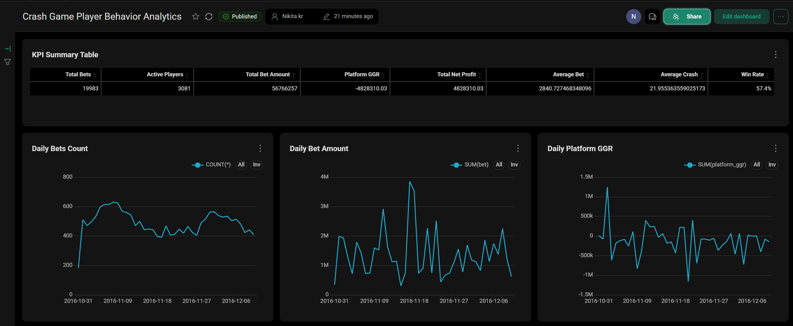

# BI Analytics Case

BI-кейс для портфолио: подготовка данных, расчёт метрик и создание интерактивного дашборда в Preset/Superset.

## О проекте

Создан интерактивный BI-дашборд для анализа пользовательской активности на открытом датасете Kaggle. В проекте показаны подготовка данных через SQL, расчёт метрик, построение графиков и оформление аналитического дашборда.

## Превью дашборда

## Ссылка на дашборд

[Открыть дашборд](https://770ebd6c.us2a.app.preset.io/superset/dashboard/10/?native_filters_key=ZixNsKEO89M21l9ytDHEgw)

## Источник данных

Kaggle: https://www.kaggle.com/datasets/kingabzpro/gambling-behavior-bustabit

В датасете есть данные по игровым событиям: пользователь, игра, сумма ставки, множитель выхода, бонус, прибыль, crash-множитель и дата события. На их основе была собрана аналитическая витрина для анализа активности, результата событий и финансового эффекта для платформы.

## Что сделано

- подготовлена аналитическая витрина через SQL;
- добавлены расчётные поля: результат события, net profit, GGR платформы, дата, час и сегменты;
- рассчитаны ключевые метрики: количество событий, активные пользователи, сумма операций, GGR, net profit, средний размер операции и win rate;
- построены графики динамики, структуры результата, активности по часам, сегментов и топовых пользователей;
- добавлена Risk Matrix по размеру операции и crash-сегменту.

## Ключевые метрики

- Total Bets — количество событий.
- Active Players — количество уникальных пользователей.
- Total Bet Amount — общий объём операций.
- Platform GGR — финансовый результат платформы.
- Total Net Profit — суммарный результат пользователей.
- Average Bet — средний размер операции.
- Average Crash — средний crash-множитель.
- Win Rate — доля успешных событий.

## Что получилось

Дашборд показывает общую картину активности: сколько было событий, сколько пользователей участвовало, какой объём операций прошёл и как менялся финансовый результат по дням. Отдельно выделены сегменты по размеру операции и crash-множителю, топ пользователей по обороту и GGR, а также матрица риска для поиска наиболее значимых комбинаций сегментов.

## Основные выводы

- основной оборот формируется крупными операциями;
- активность и сумма операций заметно меняются по дням;
- финансовый результат платформы сильно колеблется;
- небольшая группа пользователей даёт значимый вклад в общий оборот;
- Risk Matrix помогает увидеть наиболее значимые комбинации сегментов.

## Инструменты

- Preset / Apache Superset
- SQL
- Kaggle
- BI-дашборды
