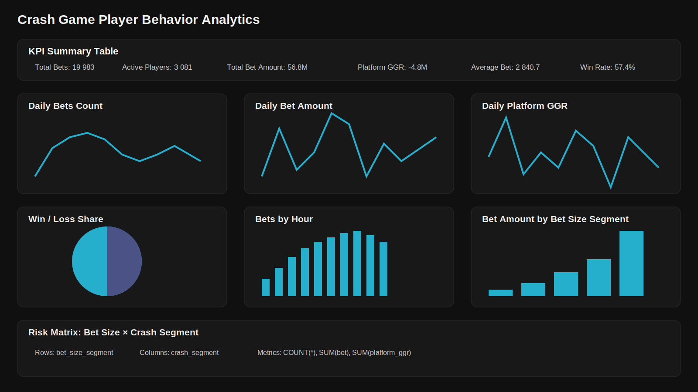

# BI Analytics Case

BI-кейс для портфолио: подготовка данных, расчёт метрик и создание интерактивного дашборда в Preset/Superset.

## О проекте

В рамках проекта был создан интерактивный BI-дашборд для анализа поведения игроков на открытом датасете Kaggle.

Дашборд показывает ключевые метрики по ставкам, активности пользователей, финансовому результату платформы, структуре выигрышей и проигрышей, сегментам ставок и топовым игрокам.

## Превью дашборда

## Ссылка на дашборд

[Открыть дашборд в Preset/Superset](https://770ebd6c.us2a.app.preset.io/superset/dashboard/10/?native_filters_key=ZixNsKEO89M21l9ytDHEgw)

> Примечание: доступ к дашборду может требовать авторизации в Preset или доступа к workspace.

## Источник данных

Данные взяты с Kaggle:

[Gambling Behavior Bustabit](https://www.kaggle.com/datasets/kingabzpro/gambling-behavior-bustabit)

В датасете содержатся данные по игровой активности пользователей Bustabit: ставки, выигрыши, прибыль, множители cashout/crash и дата игры.

## Используемые поля

Основные поля исходного датасета:

- `Id` — ID записи
- `GameID` — ID игры
- `Username` — игрок
- `Bet` — сумма ставки
- `CashedOut` — множитель выхода
- `Bonus` — бонус
- `Profit` — прибыль по ставке
- `BustedAt` — crash-множитель
- `PlayDate` — дата и время ставки

## Подготовка данных

Для дашборда была подготовлена аналитическая витрина. Через SQL были добавлены расчётные поля:

- `result` — результат ставки: Win / Loss
- `net_profit` — чистая прибыль игрока
- `platform_ggr` — финансовый результат платформы
- `bet_date` — дата ставки
- `bet_hour` — час ставки
- `bet_size_segment` — сегмент размера ставки
- `crash_segment` — сегмент crash-множителя

## Метрики

В дашборде используются следующие метрики:

- Total Bets — количество ставок
- Active Players — количество активных игроков
- Total Bet Amount — сумма ставок
- Platform GGR — финансовый результат платформы
- Total Net Profit — суммарная прибыль игроков
- Average Bet — средний размер ставки
- Average Crash — средний crash-множитель
- Win Rate — доля выигрышных ставок

## Структура дашборда

Дашборд включает следующие блоки:

1. KPI Summary Table — общая таблица ключевых метрик.
2. Daily Bets Count — динамика количества ставок по дням.
3. Daily Bet Amount — динамика суммы ставок по дням.
4. Daily Platform GGR — динамика финансового результата платформы.
5. Win / Loss Share — распределение выигрышных и проигрышных ставок.
6. Bets by Hour — активность игроков по часам.
7. Bet Amount by Bet Size Segment — оборот по сегментам размера ставки.
8. Win / Loss by Bet Size Segment — распределение выигрышей и проигрышей по размеру ставки.
9. Top 10 Players by Bet Amount — игроки с максимальным оборотом ставок.
10. Top 10 Players by Platform GGR — игроки, на которых платформа получила наибольший GGR.
11. Risk Matrix: Bet Size × Crash Segment — матрица риска по размеру ставки и crash-множителю.

## Основные выводы

- Основной оборот формируется сегментом крупных ставок.
- Активность игроков по дням меняется неравномерно.
- Финансовый результат платформы сильно колеблется по дням.
- В выборке есть отдельные игроки, которые дают значимый вклад в общий оборот.
- Risk Matrix помогает увидеть, какие комбинации размера ставки и crash-множителя сильнее влияют на оборот и GGR.

## Используемые инструменты

- Preset / Apache Superset
- SQL
- Kaggle
- BI-дашборды
- Аналитика пользовательского поведения
